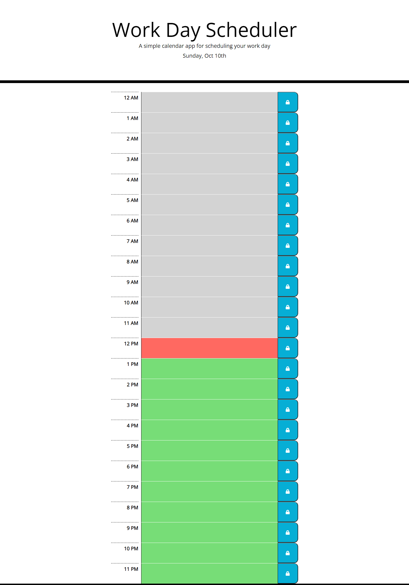

# work-day-scheduler

## Description

Our week 3 homework assignment tasked us with creating a code quiz from scratch. The acceptance criteria was a follows: 

-WHEN I open the planner

-THEN the current day is displayed at the top of the calendar

-WHEN I scroll down

-THEN I am presented with timeblocks for standard business hours

-WHEN I view the timeblocks for that day

-THEN each timeblock is color coded to indicate whether it is in the past, present, or future

-WHEN I click into a timeblock

-THEN I can enter an event

-WHEN I click the save button for that timeblock

-THEN the text for that event is saved in local storage
-WHEN I refresh the page

-THEN the saved events persist

## What I did

In HTML file: 
I created sections containing h2 elements to display time, text-area for user to type in their task/activity in the time block, and a button to save the task/activity with an icon tag inside the button tag. I also added links to js file.

In JS file:
I created an empty array to store tasks, a click event so when tasks are saves they will be stored to local storage. I also created an function and called it to render saved tasks when page is loaded. I have another function to check the current time and color the time blocks accordingly to if it's in the past, present, or future. 

In CSS:
I adjust sizing, colors, borders, and presentation for content on the page, with most of it having pre-determined classes I just had to apply in HTML.

## Finished Product

Here is a screenshot and link to the finished code quiz:
[Link to webpage](https://phalenh.github.io/work-day-scheduler/index.html)

